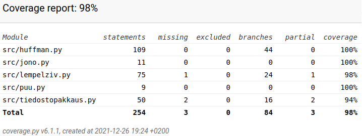

# Testausdokumentti

Ohjelmaa testataan kattavilla yksikkö- ja integraatiotesteillä.

Testauksessa tullaan huomioimaan, että pakatun tiedoston koko on odotusten mukainen ja se purkautuu alkuperäiseksi.

### Testikattavuus

Sovelluksen haarautumakattavuus on 85%.

### Järjestelmätestaus

Automaattisten testien lisäksi ohjelmaa on testattu manuaalisesti ongelmien havaitsemiseksi. Käyttöohje ja vaatimusmäärittely on otettu huomioon testauksessa.

Pakkausalgoritmeja on testattu useilla esimerkkitekstitiedostoilla, jotka löytyvät kansiosta testitiedostot.
