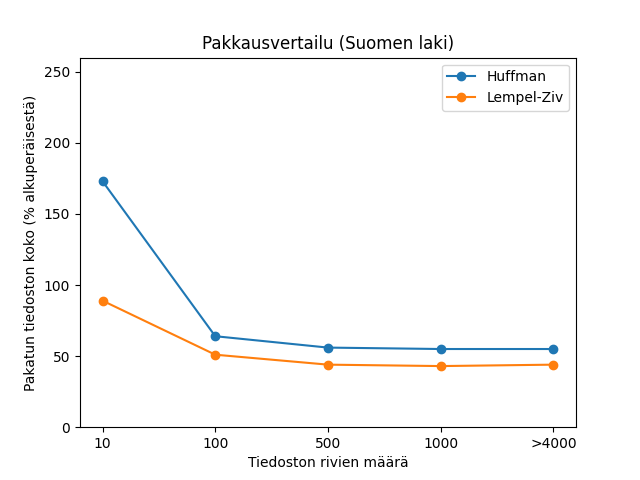
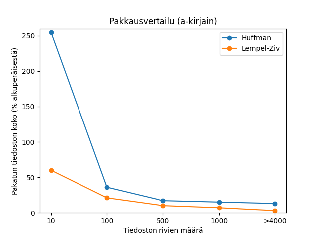

# Toteutusdokumentti

### Ohjelman yleisrakenne

Tiedostossa huffman.py toteutetaan Huffmanin algoritmi Huffman-luokan avulla. Tiedostossa lempelziv.py toteutetaan Lempel-Ziv-Welch-algoritmi luokan Lempelziv avulla. Molemmissa luokissa varsinainen pakkaus tapahtuu pakkaa-metodissa. Algoritmien toteutus noudattaa melko pitkälti alkuperäisissä artikkeleissa (Lähteet) kuvattuja toteutuksia.
    
### Vertailu

Vertailu suoritetaan tiedostossa vertailu.py. Vertailussa tarkastellaan molempien algoritmien suorituskykyä erikokoisilla esimerkkitekstitiedostoilla. Vertailussa käytetään kahta erityylistä tiedostoa eri pituisina. Ensimmäinen tiedostokokoelma sisältää 10, 100, 500, 1000 ja yli 4000 riviä pitkät otteet suomen laista. Toinen tiedostokokoelma sisältää 10, 100, 500, 1000 ja yli 4000 riviä pitkät tiedostot a-kirjainta. Ensimmäisen kokoelman on tarkoitus kuvastaa vaihtuvasisältöistä tekstiä ja toisen vahvasti toistuvaa tekstiä.

Vaihtuvasisältöisen tiedoston pakkauskoko laskee aluksi huomattavasti ja jää sitten noin 50 prosenttiin (Huffman 55 %, Lempel-Ziv 44%).

Toistosisältöisen tiedoston pakkauskoko laskee alussa huomattavasti, jonka jälkeen laskee hiljalleen alemmas (Huffman 255, 36, 17, 15 ja 13 %, Lempel-Ziv 60, 21, 10, 7 ja 3%).

Näissä esimerkeissä Lempel-Ziv vaikuttaa parhaimmalta kaikissa tapauksissa. Todellisuudessa pienillä tiedostoilla Huffmanin algoritmilla pääsisi parempaan pakkaussuhteeseen. Esimerkeissä Huffmanin pakkaukset sisältävät myös sanakirjan, jonka kokoa ei ole tässä työssä optimoitu. Ilman sanakirjaa, pakkauskoko olisi huomattavasti pienempi kuin Lempel-Zivilla.

### Puutteet ja parannusehdotukset

Pythonilla pakkausalgoritmien toteutusta vaikeuttaa se, ettei Pythonissa ole mitään helppoa tapaa tallentaa tiedostoihin yksittäisiä bittejä tai bittiryhmiä, joiden pituus ei ole jaollinen kahdeksalla, joten kaikki bitit pitää tallentaa tiedostoon tavuina. Tämän vuoksi koodissa pitää ensin yhdistää tallennettavat bitit pidemmäksi pätkäksi, joka sitten tallennetaan tiedostoon tavuina.

Huffman-pakkauksessa puutteena on, että pakkauksen purkamisessa tarvittava sanakirja pakataan mukaan pakkaustiedostoon pakkaamattomassa json-muodossa. Varsinkin pienien tiedostojen pakkauksessa tämä aiheuttaa sen, että pakattu tiedosto on itse asiassa huomattavasti suurempi kuin alkuperäinen pakkaamaton tiedosto. Suuremmilla tiedostoilla sanakirjan koko suhteessa muuhun tiedostoon on pienempi, jolloin vaikutus ei enää ole merkittävä. Sanakirja olisi varmaankin ollut mahdollista pakata vähän pienempään tilaan kuin json-muoto, mutta tämän projektin puitteissa asialla ei mielestäni ole niin suurta merkitystä, että sitä olisi kannattanut tehdä, varsinkin kun suuremmilla tiedostoilla sanakirjan pakkaamisen merkitys lopputulokseen on hyvin vähäinen.

### Lähteet

Huffman, D. A. (1952). A method for the construction of minimum-redundancy codes. Proceedings of the IRE, 40(9), 1098-1101.

Ziv, J., & Lempel, A. (1977). A universal algorithm for sequential data compression. IEEE Transactions on information theory, 23(3), 337-343.
